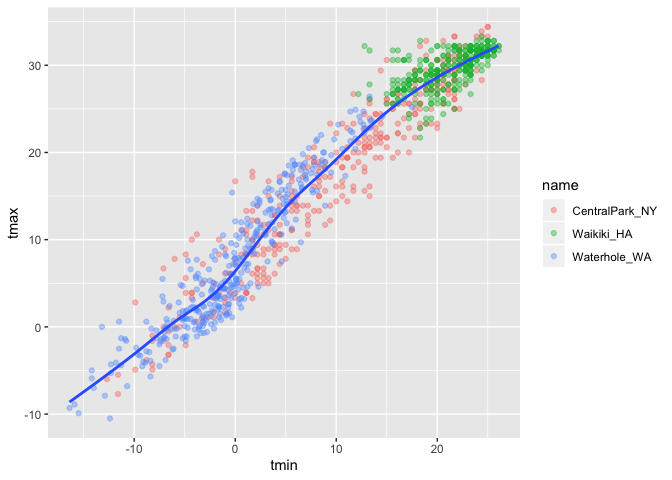
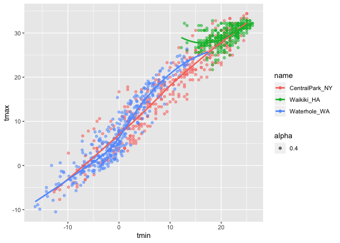

DataViz
================
Kevin S.W.
9/26/2019

# Data Viz 1

Creating ggplot from weather data from
NOAA

## Loading weather data

``` r
# Package interfaces with the weather station/service; interacts with NOAA servers and downloads the updated data
weather_df = 
  rnoaa::meteo_pull_monitors(c("USW00094728", "USC00519397", "USS0023B17S"), # Stations to download from
                      var = c("PRCP", "TMIN", "TMAX"), # which variables i want
                      date_min = "2017-01-01",     #range of dates min - max
                      date_max = "2017-12-31") %>%
  mutate(
    name = recode(id, USW00094728 = "CentralPark_NY", 
                      USC00519397 = "Waikiki_HA",
                      USS0023B17S = "Waterhole_WA"),
    tmin = tmin / 10,
    tmax = tmax / 10) %>%
  select(name, id, everything())
```

    ## Registered S3 method overwritten by 'crul':
    ##   method                 from
    ##   as.character.form_file httr

    ## Registered S3 method overwritten by 'hoardr':
    ##   method           from
    ##   print.cache_info httr

    ## file path:          /Users/NetQuarter/Library/Caches/rnoaa/ghcnd/USW00094728.dly

    ## file last updated:  2019-09-26 10:25:18

    ## file min/max dates: 1869-01-01 / 2019-09-30

    ## file path:          /Users/NetQuarter/Library/Caches/rnoaa/ghcnd/USC00519397.dly

    ## file last updated:  2019-09-26 10:25:29

    ## file min/max dates: 1965-01-01 / 2019-09-30

    ## file path:          /Users/NetQuarter/Library/Caches/rnoaa/ghcnd/USS0023B17S.dly

    ## file last updated:  2019-09-26 10:25:33

    ## file min/max dates: 1999-09-01 / 2019-09-30

``` r
weather_df
```

    ## # A tibble: 1,095 x 6
    ##    name           id          date        prcp  tmax  tmin
    ##    <chr>          <chr>       <date>     <dbl> <dbl> <dbl>
    ##  1 CentralPark_NY USW00094728 2017-01-01     0   8.9   4.4
    ##  2 CentralPark_NY USW00094728 2017-01-02    53   5     2.8
    ##  3 CentralPark_NY USW00094728 2017-01-03   147   6.1   3.9
    ##  4 CentralPark_NY USW00094728 2017-01-04     0  11.1   1.1
    ##  5 CentralPark_NY USW00094728 2017-01-05     0   1.1  -2.7
    ##  6 CentralPark_NY USW00094728 2017-01-06    13   0.6  -3.8
    ##  7 CentralPark_NY USW00094728 2017-01-07    81  -3.2  -6.6
    ##  8 CentralPark_NY USW00094728 2017-01-08     0  -3.8  -8.8
    ##  9 CentralPark_NY USW00094728 2017-01-09     0  -4.9  -9.9
    ## 10 CentralPark_NY USW00094728 2017-01-10     0   7.8  -6  
    ## # … with 1,085 more rows

## creating ggplot

``` r
ggplot(weather_df, aes(x = tmin, y = tmax)) +
  geom_point()
```

<!-- -->

``` r
# alternative way to make the plot:
weather_df %>% 
  ggplot(aes(x = tmin, y = tmax)) + 
  geom_point()
```

<!-- -->

``` r
#saving initial plots
weather_df %>% filter(name == "CentralPark_NY") #without any variable assignments, this code will "print out" immediately.
```

    ## # A tibble: 365 x 6
    ##    name           id          date        prcp  tmax  tmin
    ##    <chr>          <chr>       <date>     <dbl> <dbl> <dbl>
    ##  1 CentralPark_NY USW00094728 2017-01-01     0   8.9   4.4
    ##  2 CentralPark_NY USW00094728 2017-01-02    53   5     2.8
    ##  3 CentralPark_NY USW00094728 2017-01-03   147   6.1   3.9
    ##  4 CentralPark_NY USW00094728 2017-01-04     0  11.1   1.1
    ##  5 CentralPark_NY USW00094728 2017-01-05     0   1.1  -2.7
    ##  6 CentralPark_NY USW00094728 2017-01-06    13   0.6  -3.8
    ##  7 CentralPark_NY USW00094728 2017-01-07    81  -3.2  -6.6
    ##  8 CentralPark_NY USW00094728 2017-01-08     0  -3.8  -8.8
    ##  9 CentralPark_NY USW00094728 2017-01-09     0  -4.9  -9.9
    ## 10 CentralPark_NY USW00094728 2017-01-10     0   7.8  -6  
    ## # … with 355 more rows

``` r
# if we want to save instead, we can assign a variable to it. i.e.
scatter = weather_df %>% 
  ggplot(aes(x = tmin, y = tmax)) + 
  geom_point()

scatter
```

<!-- -->

## Adding color to plot

``` r
# Aesthetic maps can be added inside each "assignments" or just do it outside
weather_df %>% 
  ggplot(aes(x = tmin, y = tmax)) + 
  geom_point(aes(color = name), alpha = 0.4)
```

<!-- -->

## why does aes() positions matter?

``` r
# if we add geom_smooth at the end...
weather_df %>% 
  ggplot(aes(x = tmin, y = tmax)) + 
  geom_point(aes(color = name), alpha = 0.4) +
  geom_smooth(se = FALSE) # se = FALSE removes the "error bars" of the line plot
```

    ## `geom_smooth()` using method = 'gam' and formula 'y ~ s(x, bs = "cs")'

<!-- -->

``` r
# if we move the aes up to ggplot...
weather_df %>% 
  ggplot(aes(x = tmin, y = tmax, color = name)) + 
  geom_point(aes(alpha = 0.4)) +
  geom_smooth(se = FALSE) 
```

    ## `geom_smooth()` using method = 'loess' and formula 'y ~ x'

<!-- -->

by adding aes() inside the geom\_point(), it only “applies” to those
variables. If we put it into ggplot however, it will apply to
everything.

## facets\!

manipulating the data presentation beyond 1 graph

``` r
weather_df %>% 
  ggplot(aes(x = tmin, y = tmax, color = name)) + 
  geom_point(aes(alpha = 0.4)) +
  geom_smooth(se = FALSE) +
  facet_grid(~name) # the thing on the right side of the tilde, will be columns
```

    ## `geom_smooth()` using method = 'loess' and formula 'y ~ x'

<!-- -->

## lets do more plotting

``` r
# we can see temp changes over time
weather_df %>% 
  ggplot(aes(x = date, y = tmax, color = name)) +
  geom_point(aes(size = tmax), alpha = 0.3) +  # adding size = prcp into point changes the sizes based on the "intensity".
  geom_smooth(se = FALSE)
```

    ## `geom_smooth()` using method = 'loess' and formula 'y ~ x'

<!-- -->

``` r
# or if we want to see precip
weather_df %>% 
  ggplot(aes(x = date, y = prcp, color = name)) +
  geom_point() +  
  geom_smooth(se = FALSE)
```

    ## `geom_smooth()` using method = 'loess' and formula 'y ~ x'

<!-- -->

## Some extra stuff

``` r
weather_df %>% 
  ggplot(aes(x = date, y = tmax, color = name)) +
  geom_point(aes(size = tmax), alpha = 0.3) +  
  geom_smooth(size = 2, se = FALSE)
```

    ## `geom_smooth()` using method = 'loess' and formula 'y ~ x'

<!-- -->

## 2d density

``` r
weather_df %>% 
  ggplot(aes(x = tmin, y = tmax)) +
  geom_hex()
```

<!-- -->

## more plots

``` r
## Examples of univariate plots (only x variable)

# color actually only colors the "outlines".
# so we need to use "fill ="
weather_df %>% 
  ggplot(aes(x = tmax, fill = name)) +  
  geom_histogram(position = "dodge") #adding position = "dodge" allows the bars next to each other
```

    ## `stat_bin()` using `bins = 30`. Pick better value with `binwidth`.

<!-- -->

``` r
# alternatively
weather_df %>% 
  ggplot(aes(x = tmax, fill = name)) +  
  geom_histogram() +
  facet_grid(~name)
```

    ## `stat_bin()` using `bins = 30`. Pick better value with `binwidth`.

<!-- -->

``` r
#density plot...
weather_df %>% 
  ggplot(aes(x = tmax, fill = name)) +  
  geom_density(alpha = 0.3)
```

<!-- -->

``` r
# boxplots
weather_df %>% 
  ggplot(aes(x = name, y = tmax)) +  
  geom_boxplot()
```

<!-- -->

``` r
# violin plots; usually you can see a "density" plot if you turn your head sideways
weather_df %>% 
  ggplot(aes(x = name, y = tmax)) +  
  geom_violin()
```

<!-- -->

``` r
# ridge plots; useful when you have "lots" of datapoints
weather_df %>% 
  ggplot(aes(x = tmax, y = name)) +  
  geom_density_ridges() # in ggridges
```

    ## Picking joint bandwidth of 1.84

<!-- -->

# saving plots

``` r
# to save a plot; assign a name to it
gg_ridge = 
  weather_df %>% 
  ggplot(aes(x = tmax, y = name)) +  
  geom_density_ridges() # in ggridges

# format is (filename; ie location of file, which plot). if location not specified, will be local folder
ggsave("ggplot_temp_ridge.pdf", gg_ridge) 
```

    ## Saving 7 x 5 in image

    ## Picking joint bandwidth of 1.84

``` r
# possible to do ggsave() as it assumes the last plot...but this is dangerous practice.
```

# regarding boxplots and figure dimensions in RMarkdown

when specifying in the chunk the figure width…

``` r
weather_df %>% 
  ggplot(aes(x = tmin, y = tmax, color = name)) + 
  geom_point(aes(alpha = 0.4)) +
  geom_smooth(se = FALSE)
```

    ## `geom_smooth()` using method = 'loess' and formula 'y ~ x'

<!-- -->

``` r
weather_df %>% 
  ggplot(aes(x = tmin, y = tmax, color = name)) + 
  geom_point(aes(alpha = 0.4)) +
  geom_smooth(se = FALSE)
```

    ## `geom_smooth()` using method = 'loess' and formula 'y ~ x'

<!-- -->
